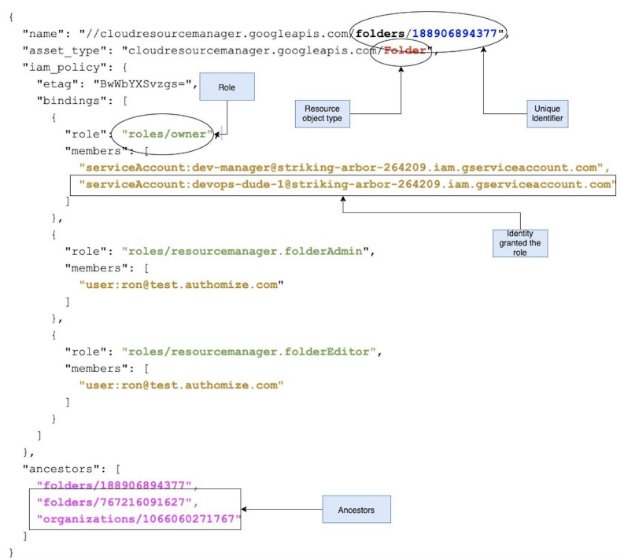

Authomize programming assignment 
--------
What is a Graph 
--
Graph is an ordered pair  = ( , ) when: 

- is a set of vertices 
- = {( , ) ∶  , ∈ ,  ≠ }is a set of edges which are an unordered pair of vertices. 

A graph may be directed or undirected. 

- Directed graph is a graph in which edges have orientations. The direction is from  to  , 

→ . In that case ( , ) ≠ ( , ) 

Implementing a Graph Guidance 
---
The reason we want to you implement the following tasks in the form of a graph is that it makes modeling permission structure simple, as well as enables expansion of the permission model and adding new features. Also, this is how we implement graph modeling, and we want to see that you can get into this state of mind. 

A Good Graph Implementation Guideline 

A structure of a graph means keeping a separate collection for: 

- nodes - representing the different entities. For now, that would be identities and resources. In a future upgrade, identity could have a subtype 
- edges - representing the **relationship between** different nodes. For example, if a resource has a parent, then an edge should represent that relationship between the nodes. Think what other relationships you should have between nodes, and represent them as well using edges. 

---------
from typing import List 

class Node: 
- type: str   \# 'identity', 'resource',
- id: str

class Edge:    
- from: Node    
- to: Node    
- type: str 

class Graph: 
- edges: List[Edge]    
- nodes: List[Node] 

def get_user_permissions(graph: Graph, user_email: str): 
- pass 
-------

Auxiliary methods and functions should be added for manipulating the graph (adding nodes and edges). 
---
General Notes 
------
- This task is long, so don’t feel bad if you don’t finish it all on time (you won’t be penalized by it) 
- The completion of the assignment, should be in the following priority order: 
  - Make all the tasks work. 
  - Make the code run faster and be more efficient. 
  - Make the code pretty (that does not mean that the code should be sloppy   ). 
  - Think of how to scale it. 
- **Implement the questions in the form of a graph.** 
- You may use the internet as much as you need and don’t be afraid to ask us as many questions as you like. 
- The exercise should be implemented using Python, without the use of an external Database software. 
- Read the whole task before you start coding. This will help you to think of a better design. 

Task 1 - Build a Permission Graph From Static Data 
------
In this task you are asked to build a permission graph based on GCP (Google Cloud Platform) permissions model. 

In order to build the graph, you need to parse a[ JSON lines file ](http://jsonlines.org/)that represents the GCP permission model. 

Each line in the file is a JSON object that looks as following: 

**Each of those lines represents a single resource in GCP**. 

Resources are organized in a tree. Each resource has a parent, and might have several children. There is a top resource of type organization. The tree structure can be inferred from the ancestors field only. The first value in the ancestors array is the resource itself, the next value is its parent, the next value is the parent of the parent, and so forth. 

bindings is the property which provides the information of **which identities** are granted **what roles** on a resource. In the above example, the two service accounts have the role/owner role. 

The resource hierarchy has a major implication on the permission structure: **if an identity has a role assigned on a resource, that role is implicitly assigned on all of its children (recursively)**. To put it another way, if an identity has a role on one of the ancestors of a resource, that role is applied on that resource as well (permission is inherited). 

Moreover, in order to calculate the permissions an identity has on resources, one has to: 

1. Find all of the role assignments of that user 
1. For each role assignment of an identity to a resource, the identity is assigned with the role for that resource, but also to the resources below it in the tree. 

The resulting combination of <resource> x <role> is the effective set of permissions of that user on resources. 

For this task, Service account (serviceaccount:xxx@xxx), Group (group:xxx@xxx) and User (user:xxx@xxx) are all considered identities and are equivalent for the purpose of this exercise. You do not need to extract the type of an identity. The task #6 will create a differentiation between them. 

Your task: 

1. Parse a file containing JSON-formatted lines representing permission policies in GCP. 
1. Build a code that **represents a graph** containing different entities (Identities and Resources) **and the links between entities**. 

Notes: 

- Build the basic graph implementation now, and plan how you will expand later to support the next tasks. 
- You are the architect of this graph implementation, and you want it to be useful in the future. Keep in mind how you would expand it to support various other tasks (e.g, representing groups, nested groups, more complicated questions about user-resource permissions. Take a look at the rest of this exercise for some examples). **You will be asked to explain your design considerations, and how you would upgrade the graph implementation to support new node types and relationships (edges)**. 

Task 2 - Resource hierarchy 
-----
In this task, given a Resource, you need to return all the hierarchy of the resource 

**Input:** Resource unique ID 

**Output:** a list of of all the ancestors of the resource (in order starting from the given resource) 

Example: 

If the resource hierarchy looks like this: Organization1 

- Folder1 
  - Folder4 
  - Folder5 
    - Folder6 
- Folder2 
- Folder3  

Input: ‘Folder6’ 

Output:  

[‘Folder5’, ‘Folder1’, ‘Organization1’] 

Task 3 - Who has what 
-----
In this task, given an Identity, you need to return all the resources that identity has permissions on. 

**Input:** Identity unique ID 

**Output:** a list of tuples of all the Resources that the Identity has permissions on.  

Each tuple should be as following: (Resource name, Resource type, Role) 

(Note that there might be a hierarchy in the resources, and in that case we would like to get all of them ) 

Example: 

Input: ‘alex@test.authomize.com’ Output:  

[  

`  `(‘folder1’, ‘Folder’, ‘owner’),   (‘folder2’, ‘Folder’, ‘editor’),   ... 

] 

Task 4 - What has who 
----
In this task, given a Resource, you need to return all the Identities that have permissions on that resource. 

**Input:** Resource unique ID 

**Output:** a list of tuples of all the Identities that have permissions on the Resource Each tuple should be as following: (Identity name, Role) 

Example: 

Input: ‘folder\_1234’ 

Output:  

[  

`  `(‘alex@authomize.com’, ‘viewer’),   (‘ron@authomize.com’, ‘editor’),   ... 

] 

Task 5  - Downloading User Data From Google 
-----
As you may have noticed, in our graph we don’t have much info about the Identities (User / Group/ Service account) because this data is missing from our input file. 

In order to complete that task, you will need to get the relevant info using GoogleAdminAPI, using a key file: 

Getting users info from Google API: 

1. Using the Service Account JSON (we will provide it), connect to DirectoryService API (https://developers.google.com/admin-sdk/directory) 
1. From the DirectoryService get all the users (https://developers.google.com/admin- sdk/directory/v1/reference/users/list). Notice that you need to use the minimal scope possible (read only) where possible, as this is the scope permitted for the service account. 

Additional information: the service account has domain-delegated permissions. The admin account of the organization is ron@test.authomize.com. 

You need to investigate the documentation about how to use the API to get the necessary data. 

**Output:**  

1. Fetch the list of all users in the organization. 
1. Fetch the list of all groups in the organization. 
1. Fetch the list of users in each group. 

Task 6  - Identities Enrichment (Bonus) 
-----
Answer previous tasks, but this time don’t stop at the identity level. 

1. For user->resource walks, make sure you also go through groups a user belongs to and are granted with permissions. 
1. For resource->user walks, don’t stop at the group, but return the list of actual users (and service accounts). 
